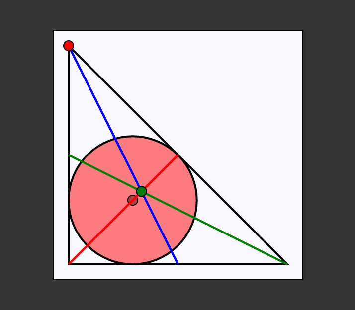

status: incompleto e em andamento...

  <h1>📐⚪📏Circle inscribed in triangle </h1>
  <h6>by <i>FranciscoCharles</i></h6>

This is just a simple example made with just HTML, basic CSS and pure JS (VanilhaJS). The program only shows a triangle with a circle inscribed on it, there is a vertex you can move around the screen, signaled by a small red circle (when hovering over this vertex the cursor type changes to indicate the correct vertex). There are two other points highlighted in the figure, the barycenter of the triangle and the center of the inscribed circle, in order to make it easier to see that both are distinct points, coinciding only when an equilateral triangle is formed.

    
     
    <h6>
        Figure 1 - example screen of program execution
    </h6>  

# <a name=index>Table of contents 📚</a>

- [**How can i run?**](#run)
- [**Version**](#version)
- [**License**](#license)

# **<a name=run>How can I run? 🧠💭</a>** <h6>[back to indice](#index)</h6>

 Download the project, go to the `code` folder and open the `index.html` file in a browser like Firefox or Chrome.

# **<a name=version>Version</a>**  <h6>[back to indice](#index)</h6>
- current version of the project: 0.2.4.

# **<a name=license>License</a>**  <h6>[back to indice](#index)</h6>

For more information on the license for this project read the <a href="./LICENSE" title="go to license file">LICENSE</a> file.

---

    Copyright © 2021 <b>FranciscoCharles</b>

